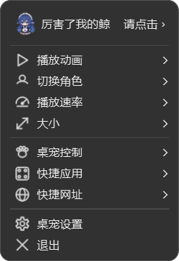
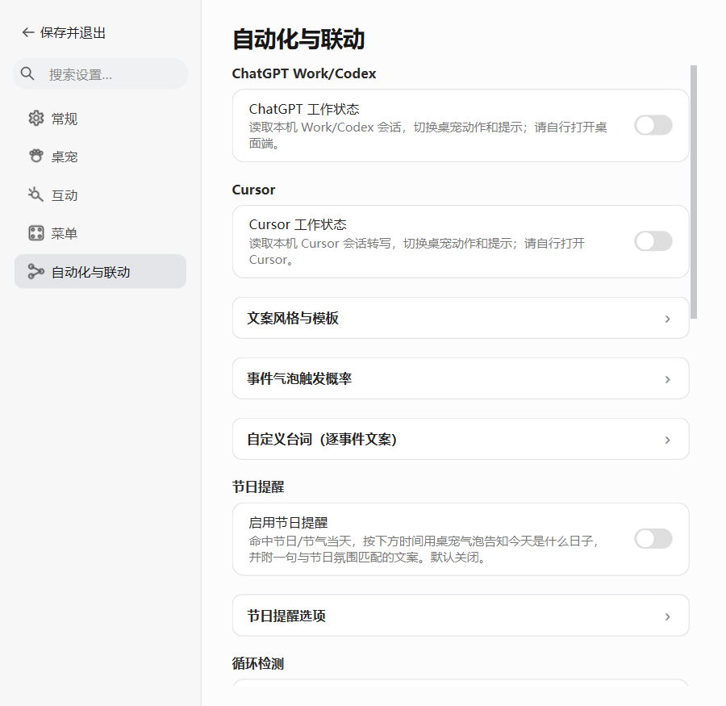
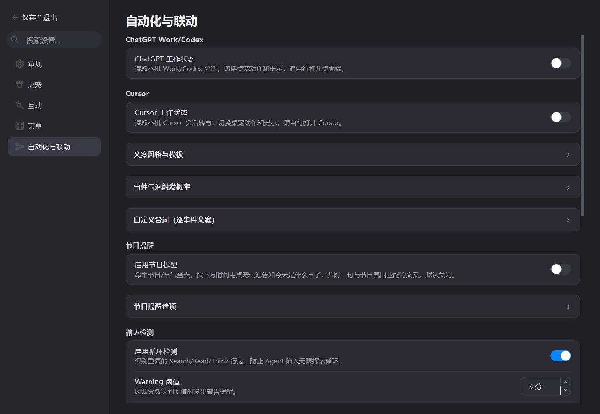

# 鲸鱼娘菜单与托盘反馈（2026-10-04，2026-10-05完成交付整理）

本次交付合并[上一轮清理](PR-REPORT-PET-CLEANUP-TRAY-2026-10-04.md)与最新反馈；基线为main的2b79146，保留开始工作时已有的用户修改。用户授权恢复“厉害了我的鲸 · 请点击”首行，点击播放桌宠回应；修复托盘开机自启反馈，内置行为检测，普通联动气泡延长2秒，删除待办及无用文档，并在验证后推送GitHub。

## 修改文件说明

托盘显示鲸鱼娘头像及名称，开机自启点击后写入并回读真实状态：成功展示勾选和提醒，失败显示原因并保存实际状态。查询不写注册表，首次启用可创建Run键。右键及托盘共用上一版现代菜单样式和勾选渲染，Windows字体采用微软雅黑UI。首行只回应，不打开图片窗口。

W6/W10行为阈值改用内置默认值；删除旧配置覆写键和界面控件，实际重复/卡住检测保留。普通工作/思考/结束气泡统一延长2秒，重试保持原时长；等待批准或回答的持续提醒仍按现有生命周期收口。待办服务、窗口、菜单、配置及专用测试一并删除，外部用户历史数据不被主动删除。

清理包括前一轮省电、灵动岛、菜单编排和彩蛋代码，现有共享解码和多窗口联动保留。移除空解码绑定/关闭接口、无用别名及永不执行的按钮分支。共享联动的pause/resume覆写用于防止隐藏一只宠物影响其它窗口，属于必要接口约束。日志中的TodoWrite工具名仍用于描述外部工作行为。不能从静态检索证明每条异常兜底永远被运行，本轮仅移除已确认退役、无调用或无功能的代码。

43份旧MD在本轮删除；相对于本次合并提交的基线，还包括上一轮删除的重复技能和旧截图。README、LICENSE、THIRD_PARTY_NOTICES及当前维护/构建约束保留。修改前备份和运行日志在仓库外work/2026-10-04-feedback，历史文件可从Git记录恢复。所有当前文档在[INDEX](INDEX.md)登记，旧材料不再作为当前入口。

下表按git diff --numstat及新增文件逐项列出累积变更；二进制以“—”表示，不把图片字节当作代码行数。本报告自身行数在生成后同步。

| 文件 | 状态 | 增行 | 删行 | 改了什么及原因 |
|---|---|---:|---:|---|
| `.agents/skills/desktop-pet-ui-style/references/visual-system.md` | 修改 | 15 | 0 | 同步当前菜单、托盘、气泡及设置契约，供后续UI修改遵循。 |
| `AGENTS.md` | 修改 | 1 | 6 | 修复删除旧文档后失效的入口，保留工程门禁。 |
| `C++-Python/src/collision.cpp` | 修改 | 1 | 5 | 移除灵动岛专属静态弹墙分支，与Python求解保持一致。 |
| `CONTEXT.md` | 修改 | 14 | 16 | 更新固定菜单、托盘归属和当前功能契约，避免误恢复退役功能。 |
| `README.md` | 修改 | 10 | 5 | 使用鲸鱼娘名称，说明当前桌宠、托盘、联动及运行方法。 |
| `SKIll/Agent-Code/SKILL.md` | 删除 | 0 | 49 | 移除无人引用的重复技能副本，当前工程规范集中在.agents及AGENTS。 |
| `SKIll/Agent-Code/references/debugging.md` | 删除 | 0 | 44 | 移除无人引用的重复技能副本，当前工程规范集中在.agents及AGENTS。 |
| `SKIll/Agent-Code/references/design.md` | 删除 | 0 | 42 | 移除无人引用的重复技能副本，当前工程规范集中在.agents及AGENTS。 |
| `SKIll/Agent-Code/references/implementation.md` | 删除 | 0 | 42 | 移除无人引用的重复技能副本，当前工程规范集中在.agents及AGENTS。 |
| `SKIll/Agent-Code/references/planning.md` | 删除 | 0 | 42 | 移除无人引用的重复技能副本，当前工程规范集中在.agents及AGENTS。 |
| `SKIll/Agent-Code/references/verification.md` | 删除 | 0 | 47 | 移除无人引用的重复技能副本，当前工程规范集中在.agents及AGENTS。 |
| `SKIll/En-SKILL.md` | 删除 | 0 | 145 | 移除无人引用的重复技能副本，当前工程规范集中在.agents及AGENTS。 |
| `docs/ACCEPTANCE_TESTS.md` | 删除 | 0 | 58 | 删除退役功能、重复计划或过时版本材料；当前说明与证据由INDEX中的文档接替。 |
| `docs/AGENT_LINK_PROTOCOL.md` | 修改 | 1 | 1 | 更新当前功能范围及有效文档入口，去除退休功能或死链接。 |
| `docs/BUGFIX-AND-FEATURES-2026-08-24.md` | 删除 | 0 | 223 | 删除退役功能、重复计划或过时版本材料；当前说明与证据由INDEX中的文档接替。 |
| `docs/BUILD-CI-FAILURE-NOTES-2026-08.md` | 删除 | 0 | 237 | 删除退役功能、重复计划或过时版本材料；当前说明与证据由INDEX中的文档接替。 |
| `docs/CHANGELOG-DEV-SINCE-v4.1.0-2026-09-09.md` | 删除 | 0 | 199 | 删除退役功能、重复计划或过时版本材料；当前说明与证据由INDEX中的文档接替。 |
| `docs/CHAT-BACKGROUND-DISPLAY-2026-08-27.md` | 删除 | 0 | 21 | 删除退役功能、重复计划或过时版本材料；当前说明与证据由INDEX中的文档接替。 |
| `docs/COLLISION-NATIVE-BASELINE-2026-09-24.md` | 修改 | 1 | 1 | 更新当前功能范围及有效文档入口，去除退休功能或死链接。 |
| `docs/CONTEXT-MENU-RESEARCH-AND-REFACTOR-2026-08-25.md` | 修改 | 2 | 0 | 更新当前功能范围及有效文档入口，去除退休功能或死链接。 |
| `docs/DEV-HANDOVER.md` | 修改 | 23 | 594 | 更新当前功能范围及有效文档入口，去除退休功能或死链接。 |
| `docs/HANDOVER_2026-09.md` | 删除 | 0 | 130 | 删除退役功能、重复计划或过时版本材料；当前说明与证据由INDEX中的文档接替。 |
| `docs/INDEX.md` | 修改 | 46 | 204 | 更新当前功能范围及有效文档入口，去除退休功能或死链接。 |
| `docs/ISSUE-EDGE-TTS-VOICE-DEPRECATION-2026-09-22.md` | 删除 | 0 | 65 | 删除退役功能、重复计划或过时版本材料；当前说明与证据由INDEX中的文档接替。 |
| `docs/NETWORK-PROXY-AND-VPN-2026-09-22.md` | 删除 | 0 | 99 | 删除退役功能、重复计划或过时版本材料；当前说明与证据由INDEX中的文档接替。 |
| `docs/ONEDIR_PACKAGING.md` | 修改 | 19 | 83 | 更新当前功能范围及有效文档入口，去除退休功能或死链接。 |
| `docs/PET-STATE-MACHINE-AND-REPETITION-2026-09-02.md` | 修改 | 4 | 4 | 更新当前功能范围及有效文档入口，去除退休功能或死链接。 |
| `docs/PR-REPORT-CANDIDATE-PROMOTION-2026-09-26.md` | 删除 | 0 | 83 | 删除退役功能、重复计划或过时版本材料；当前说明与证据由INDEX中的文档接替。 |
| `docs/PR-REPORT-CANDIDATE-SECOND-REVIEW-2026-09-26.md` | 删除 | 0 | 78 | 删除退役功能、重复计划或过时版本材料；当前说明与证据由INDEX中的文档接替。 |
| `docs/PR-REPORT-CHATGPT-LINK-2026-10-03.md` | 删除 | 0 | 360 | 删除退役功能、重复计划或过时版本材料；当前说明与证据由INDEX中的文档接替。 |
| `docs/PR-REPORT-COLLISION-REMEDIATION-2026-09-24.md` | 删除 | 0 | 73 | 删除退役功能、重复计划或过时版本材料；当前说明与证据由INDEX中的文档接替。 |
| `docs/PR-REPORT-DESKTOP-AGENT-LINK-2026-09-29.md` | 删除 | 0 | 120 | 删除退役功能、重复计划或过时版本材料；当前说明与证据由INDEX中的文档接替。 |
| `docs/PR-REPORT-FESTIVAL-REMINDER-2026-09-16.md` | 删除 | 0 | 205 | 删除退役功能、重复计划或过时版本材料；当前说明与证据由INDEX中的文档接替。 |
| `docs/PR-REPORT-GATES-2026-09-10.md` | 删除 | 0 | 397 | 删除退役功能、重复计划或过时版本材料；当前说明与证据由INDEX中的文档接替。 |
| `docs/PR-REPORT-ISLAND-HIDDEN-CHAT-DEADLOCK-2026-09-23.md` | 删除 | 0 | 99 | 删除退役功能、重复计划或过时版本材料；当前说明与证据由INDEX中的文档接替。 |
| `docs/PR-REPORT-ISLAND-RESHOW-NOCHAT-2026-09-23.md` | 删除 | 0 | 114 | 删除退役功能、重复计划或过时版本材料；当前说明与证据由INDEX中的文档接替。 |
| `docs/PR-REPORT-LOCAL-WIP-BATCH-2026-09-22.md` | 删除 | 0 | 169 | 删除退役功能、重复计划或过时版本材料；当前说明与证据由INDEX中的文档接替。 |
| `docs/PR-REPORT-PERF-ISLAND-CONSOLIDATED-2026-09-23.md` | 删除 | 0 | 164 | 删除退役功能、重复计划或过时版本材料；当前说明与证据由INDEX中的文档接替。 |
| `docs/PR-REPORT-PERSONAL-PHASE-A-2026-09-27.md` | 删除 | 0 | 56 | 删除退役功能、重复计划或过时版本材料；当前说明与证据由INDEX中的文档接替。 |
| `docs/PR-REPORT-PERSONAL-PHASE-B1-2026-09-27.md` | 删除 | 0 | 47 | 删除退役功能、重复计划或过时版本材料；当前说明与证据由INDEX中的文档接替。 |
| `docs/PR-REPORT-PERSONAL-PHASE-B2-2026-09-27.md` | 删除 | 0 | 79 | 删除退役功能、重复计划或过时版本材料；当前说明与证据由INDEX中的文档接替。 |
| `docs/PR-REPORT-PET-CLEANUP-TRAY-2026-10-04.md` | 新增 | 164 | 0 | 记录当前变更、性能及实机证据，修复对已删历史材料的引用。 |
| `docs/PR-REPORT-PR76-2026-09-10.md` | 删除 | 0 | 151 | 删除退役功能、重复计划或过时版本材料；当前说明与证据由INDEX中的文档接替。 |
| `docs/PR-REPORT-PURE-PET-REPACK-2026-10-03.md` | 修改 | 1 | 1 | 记录当前变更、性能及实机证据，修复对已删历史材料的引用。 |
| `docs/PR-REPORT-SELF-TALK-IMAGE-CHANCE-2026-09-20.md` | 删除 | 0 | 157 | 删除退役功能、重复计划或过时版本材料；当前说明与证据由INDEX中的文档接替。 |
| `docs/PR-REPORT-SELF-TALK-PRECACHE-2026-09-20.md` | 删除 | 0 | 239 | 删除退役功能、重复计划或过时版本材料；当前说明与证据由INDEX中的文档接替。 |
| `docs/PR-REPORT-SETTINGS-INTERACTION-TABS-2026-09-22.md` | 删除 | 0 | 111 | 删除退役功能、重复计划或过时版本材料；当前说明与证据由INDEX中的文档接替。 |
| `docs/PR-REPORT-SILENT-PET-2026-10-03.md` | 删除 | 0 | 166 | 删除退役功能、重复计划或过时版本材料；当前说明与证据由INDEX中的文档接替。 |
| `docs/PR-REPORT-VOICE-CHIME-2026-09-15.md` | 删除 | 0 | 330 | 删除退役功能、重复计划或过时版本材料；当前说明与证据由INDEX中的文档接替。 |
| `docs/PR-REPORT-WHALE-TRAY-FEEDBACK-2026-10-04.md` | 新增 | 318 | 0 | 记录当前变更、性能及实机证据，修复对已删历史材料的引用。 |
| `docs/PROACTIVE_SCREEN_PLAN.md` | 删除 | 0 | 113 | 删除退役功能、重复计划或过时版本材料；当前说明与证据由INDEX中的文档接替。 |
| `docs/RELEASE-v4.2.0.md` | 删除 | 0 | 182 | 删除退役功能、重复计划或过时版本材料；当前说明与证据由INDEX中的文档接替。 |
| `docs/RELEASE-v4.2.1.md` | 删除 | 0 | 257 | 删除退役功能、重复计划或过时版本材料；当前说明与证据由INDEX中的文档接替。 |
| `docs/SETTINGS-INFORMATION-ARCHITECTURE-2026-08-27.md` | 删除 | 0 | 54 | 删除退役功能、重复计划或过时版本材料；当前说明与证据由INDEX中的文档接替。 |
| `docs/SETTINGS-REDESIGN-IMPLEMENTATION-LOG.md` | 删除 | 0 | 161 | 删除退役功能、重复计划或过时版本材料；当前说明与证据由INDEX中的文档接替。 |
| `docs/SETTINGS-REDESIGN-Q4-CLASSIFICATION-RESEARCH.md` | 删除 | 0 | 312 | 删除退役功能、重复计划或过时版本材料；当前说明与证据由INDEX中的文档接替。 |
| `docs/SETTINGS-REDESIGN-Q6-Q7-DOMAIN-LAYOUT-DECISION.md` | 删除 | 0 | 414 | 删除退役功能、重复计划或过时版本材料；当前说明与证据由INDEX中的文档接替。 |
| `docs/screenshots/music-player-paths-2026-09-22/桌宠-音乐关联-1100.png` | 删除 | — | — | 移除已退役页面的旧截图，避免把历史功能当成当前说明。 |
| `docs/screenshots/music-player-paths-2026-09-22/桌宠-音乐关联-720.png` | 删除 | — | — | 移除已退役页面的旧截图，避免把历史功能当成当前说明。 |
| `docs/screenshots/self-talk-2026-09-22/互动-点击反馈-720-字体130.png` | 删除 | — | — | 移除已退役页面的旧截图，避免把历史功能当成当前说明。 |
| `docs/screenshots/self-talk-2026-09-22/互动-点击反馈-新增两行-1100.png` | 删除 | — | — | 移除已退役页面的旧截图，避免把历史功能当成当前说明。 |
| `docs/screenshots/self-talk-2026-09-22/互动-配图概率-720.png` | 删除 | — | — | 移除已退役页面的旧截图，避免把历史功能当成当前说明。 |
| `docs/screenshots/settings-interaction-tabs-2026-09-22/互动-点击与音效-1100.png` | 删除 | — | — | 移除已退役页面的旧截图，避免把历史功能当成当前说明。 |
| `docs/screenshots/settings-interaction-tabs-2026-09-22/互动-点击与音效-720.png` | 删除 | — | — | 移除已退役页面的旧截图，避免把历史功能当成当前说明。 |
| `docs/screenshots/settings-interaction-tabs-2026-09-22/互动-自言自语-1100-字体130.png` | 删除 | — | — | 移除已退役页面的旧截图，避免把历史功能当成当前说明。 |
| `docs/screenshots/settings-interaction-tabs-2026-09-22/互动-自言自语-1100.png` | 删除 | — | — | 移除已退役页面的旧截图，避免把历史功能当成当前说明。 |
| `docs/screenshots/settings-redesign/iteration-3-accessibility/04-菜单.png` | 删除 | — | — | 移除已退役页面的旧截图，避免把历史功能当成当前说明。 |
| `docs/screenshots/settings-redesign/iteration-3-accessibility/06-AI-与对话.png` | 删除 | — | — | 移除已退役页面的旧截图，避免把历史功能当成当前说明。 |
| `docs/screenshots/settings-redesign/iteration-8-masonry-dark/03-互动-图片目录抽屉.png` | 删除 | — | — | 移除已退役页面的旧截图，避免把历史功能当成当前说明。 |
| `docs/screenshots/settings-redesign/iteration-8-masonry-wide/03-互动-图片目录抽屉.png` | 删除 | — | — | 移除已退役页面的旧截图，避免把历史功能当成当前说明。 |
| `docs/screenshots/settings-redesign/iteration-9-menu-responsive-compact/01-常规.png` | 删除 | — | — | 移除已退役页面的旧截图，避免把历史功能当成当前说明。 |
| `docs/screenshots/settings-redesign/iteration-9-menu-responsive-compact/02-桌宠.png` | 删除 | — | — | 移除已退役页面的旧截图，避免把历史功能当成当前说明。 |
| `docs/screenshots/settings-redesign/iteration-9-menu-responsive-compact/03-互动.png` | 删除 | — | — | 移除已退役页面的旧截图，避免把历史功能当成当前说明。 |
| `docs/screenshots/settings-redesign/iteration-9-menu-responsive-compact/04-菜单.png` | 删除 | — | — | 移除已退役页面的旧截图，避免把历史功能当成当前说明。 |
| `docs/screenshots/settings-redesign/iteration-9-menu-responsive-compact/05-桌面组件.png` | 删除 | — | — | 移除已退役页面的旧截图，避免把历史功能当成当前说明。 |
| `docs/screenshots/settings-redesign/iteration-9-menu-responsive-compact/06-AI-与对话.png` | 删除 | — | — | 移除已退役页面的旧截图，避免把历史功能当成当前说明。 |
| `docs/screenshots/settings-redesign/iteration-9-menu-responsive-compact/07-自动化与联动.png` | 删除 | — | — | 移除已退役页面的旧截图，避免把历史功能当成当前说明。 |
| `docs/screenshots/settings-redesign/iteration-9-menu-responsive-dark/01-常规.png` | 删除 | — | — | 移除已退役页面的旧截图，避免把历史功能当成当前说明。 |
| `docs/screenshots/settings-redesign/iteration-9-menu-responsive-dark/02-桌宠.png` | 删除 | — | — | 移除已退役页面的旧截图，避免把历史功能当成当前说明。 |
| `docs/screenshots/settings-redesign/iteration-9-menu-responsive-dark/03-互动.png` | 删除 | — | — | 移除已退役页面的旧截图，避免把历史功能当成当前说明。 |
| `docs/screenshots/settings-redesign/iteration-9-menu-responsive-dark/04-菜单.png` | 删除 | — | — | 移除已退役页面的旧截图，避免把历史功能当成当前说明。 |
| `docs/screenshots/settings-redesign/iteration-9-menu-responsive-dark/05-桌面组件.png` | 删除 | — | — | 移除已退役页面的旧截图，避免把历史功能当成当前说明。 |
| `docs/screenshots/settings-redesign/iteration-9-menu-responsive-dark/06-AI-与对话.png` | 删除 | — | — | 移除已退役页面的旧截图，避免把历史功能当成当前说明。 |
| `docs/screenshots/settings-redesign/iteration-9-menu-responsive-dark/07-自动化与联动.png` | 删除 | — | — | 移除已退役页面的旧截图，避免把历史功能当成当前说明。 |
| `docs/screenshots/settings-redesign/iteration-9-menu-responsive-medium/04-菜单.png` | 删除 | — | — | 移除已退役页面的旧截图，避免把历史功能当成当前说明。 |
| `docs/screenshots/settings-redesign/iteration-9-menu-responsive-wide/01-常规.png` | 删除 | — | — | 移除已退役页面的旧截图，避免把历史功能当成当前说明。 |
| `docs/screenshots/settings-redesign/iteration-9-menu-responsive-wide/02-桌宠.png` | 删除 | — | — | 移除已退役页面的旧截图，避免把历史功能当成当前说明。 |
| `docs/screenshots/settings-redesign/iteration-9-menu-responsive-wide/03-互动.png` | 删除 | — | — | 移除已退役页面的旧截图，避免把历史功能当成当前说明。 |
| `docs/screenshots/settings-redesign/iteration-9-menu-responsive-wide/04-菜单-停用状态.png` | 删除 | — | — | 移除已退役页面的旧截图，避免把历史功能当成当前说明。 |
| `docs/screenshots/settings-redesign/iteration-9-menu-responsive-wide/04-菜单-别名保留原名.png` | 删除 | — | — | 移除已退役页面的旧截图，避免把历史功能当成当前说明。 |
| `docs/screenshots/settings-redesign/iteration-9-menu-responsive-wide/04-菜单-图片显示方式.png` | 删除 | — | — | 移除已退役页面的旧截图，避免把历史功能当成当前说明。 |
| `docs/screenshots/settings-redesign/iteration-9-menu-responsive-wide/04-菜单-外观.png` | 删除 | — | — | 移除已退役页面的旧截图，避免把历史功能当成当前说明。 |
| `docs/screenshots/settings-redesign/iteration-9-menu-responsive-wide/04-菜单-快捷启动.png` | 删除 | — | — | 移除已退役页面的旧截图，避免把历史功能当成当前说明。 |
| `docs/screenshots/settings-redesign/iteration-9-menu-responsive-wide/04-菜单-快捷启动下拉.png` | 删除 | — | — | 移除已退役页面的旧截图，避免把历史功能当成当前说明。 |
| `docs/screenshots/settings-redesign/iteration-9-menu-responsive-wide/04-菜单-排序下拉.png` | 删除 | — | — | 移除已退役页面的旧截图，避免把历史功能当成当前说明。 |
| `docs/screenshots/settings-redesign/iteration-9-menu-responsive-wide/04-菜单-移动下拉.png` | 删除 | — | — | 移除已退役页面的旧截图，避免把历史功能当成当前说明。 |
| `docs/screenshots/settings-redesign/iteration-9-menu-responsive-wide/04-菜单-自定义下拉.png` | 删除 | — | — | 移除已退役页面的旧截图，避免把历史功能当成当前说明。 |
| `docs/screenshots/settings-redesign/iteration-9-menu-responsive-wide/04-菜单-菜单模式下拉.png` | 删除 | — | — | 移除已退役页面的旧截图，避免把历史功能当成当前说明。 |
| `docs/screenshots/settings-redesign/iteration-9-menu-responsive-wide/04-菜单-菜单编排.png` | 删除 | — | — | 移除已退役页面的旧截图，避免把历史功能当成当前说明。 |
| `docs/screenshots/settings-redesign/iteration-9-menu-responsive-wide/04-菜单.png` | 删除 | — | — | 移除已退役页面的旧截图，避免把历史功能当成当前说明。 |
| `docs/screenshots/settings-redesign/iteration-9-menu-responsive-wide/05-桌面组件.png` | 删除 | — | — | 移除已退役页面的旧截图，避免把历史功能当成当前说明。 |
| `docs/screenshots/settings-redesign/iteration-9-menu-responsive-wide/06-AI-与对话.png` | 删除 | — | — | 移除已退役页面的旧截图，避免把历史功能当成当前说明。 |
| `docs/screenshots/settings-redesign/iteration-9-menu-responsive-wide/07-自动化与联动.png` | 删除 | — | — | 移除已退役页面的旧截图，避免把历史功能当成当前说明。 |
| `docs/screenshots/settings-redesign/quick-chat-focus-regression-macos.png` | 删除 | — | — | 移除已退役页面的旧截图，避免把历史功能当成当前说明。 |
| `docs/screenshots/settings-redesign/quick-chat-self-talk-activation-macos.png` | 删除 | — | — | 移除已退役页面的旧截图，避免把历史功能当成当前说明。 |
| `docs/screenshots/silent-pet-2026-10-03/dark-1100-companions.png` | 删除 | — | — | 移除已退役页面的旧截图，避免把历史功能当成当前说明。 |
| `docs/screenshots/silent-pet-2026-10-03/light-720-movement.png` | 删除 | — | — | 移除已退役页面的旧截图，避免把历史功能当成当前说明。 |
| `docs/screenshots/todo-reminder/panel-dark.png` | 删除 | — | — | 移除已退役页面的旧截图，避免把历史功能当成当前说明。 |
| `docs/screenshots/todo-reminder/panel-editor-open.png` | 删除 | — | — | 移除已退役页面的旧截图，避免把历史功能当成当前说明。 |
| `docs/screenshots/todo-reminder/panel-light.png` | 删除 | — | — | 移除已退役页面的旧截图，避免把历史功能当成当前说明。 |
| `docs/screenshots/todo-reminder/spec-1100-dark/01-常规.png` | 删除 | — | — | 移除已退役页面的旧截图，避免把历史功能当成当前说明。 |
| `docs/screenshots/todo-reminder/spec-1100-dark/02-桌宠.png` | 删除 | — | — | 移除已退役页面的旧截图，避免把历史功能当成当前说明。 |
| `docs/screenshots/todo-reminder/spec-1100-dark/03-互动.png` | 删除 | — | — | 移除已退役页面的旧截图，避免把历史功能当成当前说明。 |
| `docs/screenshots/todo-reminder/spec-1100-dark/04-菜单.png` | 删除 | — | — | 移除已退役页面的旧截图，避免把历史功能当成当前说明。 |
| `docs/screenshots/todo-reminder/spec-1100-dark/05-桌面组件.png` | 删除 | — | — | 移除已退役页面的旧截图，避免把历史功能当成当前说明。 |
| `docs/screenshots/todo-reminder/spec-1100-dark/06-AI-与对话.png` | 删除 | — | — | 移除已退役页面的旧截图，避免把历史功能当成当前说明。 |
| `docs/screenshots/todo-reminder/spec-1100-dark/07-自动化与联动.png` | 删除 | — | — | 移除已退役页面的旧截图，避免把历史功能当成当前说明。 |
| `docs/screenshots/todo-reminder/spec-1100/01-常规.png` | 删除 | — | — | 移除已退役页面的旧截图，避免把历史功能当成当前说明。 |
| `docs/screenshots/todo-reminder/spec-1100/02-桌宠.png` | 删除 | — | — | 移除已退役页面的旧截图，避免把历史功能当成当前说明。 |
| `docs/screenshots/todo-reminder/spec-1100/03-互动.png` | 删除 | — | — | 移除已退役页面的旧截图，避免把历史功能当成当前说明。 |
| `docs/screenshots/todo-reminder/spec-1100/04-菜单.png` | 删除 | — | — | 移除已退役页面的旧截图，避免把历史功能当成当前说明。 |
| `docs/screenshots/todo-reminder/spec-1100/05-桌面组件.png` | 删除 | — | — | 移除已退役页面的旧截图，避免把历史功能当成当前说明。 |
| `docs/screenshots/todo-reminder/spec-1100/06-AI-与对话.png` | 删除 | — | — | 移除已退役页面的旧截图，避免把历史功能当成当前说明。 |
| `docs/screenshots/todo-reminder/spec-1100/07-自动化与联动.png` | 删除 | — | — | 移除已退役页面的旧截图，避免把历史功能当成当前说明。 |
| `docs/screenshots/todo-reminder/spec-720/01-常规.png` | 删除 | — | — | 移除已退役页面的旧截图，避免把历史功能当成当前说明。 |
| `docs/screenshots/todo-reminder/spec-720/02-桌宠.png` | 删除 | — | — | 移除已退役页面的旧截图，避免把历史功能当成当前说明。 |
| `docs/screenshots/todo-reminder/spec-720/03-互动.png` | 删除 | — | — | 移除已退役页面的旧截图，避免把历史功能当成当前说明。 |
| `docs/screenshots/todo-reminder/spec-720/04-菜单.png` | 删除 | — | — | 移除已退役页面的旧截图，避免把历史功能当成当前说明。 |
| `docs/screenshots/todo-reminder/spec-720/05-桌面组件.png` | 删除 | — | — | 移除已退役页面的旧截图，避免把历史功能当成当前说明。 |
| `docs/screenshots/todo-reminder/spec-720/06-AI-与对话.png` | 删除 | — | — | 移除已退役页面的旧截图，避免把历史功能当成当前说明。 |
| `docs/screenshots/todo-reminder/spec-720/07-自动化与联动.png` | 删除 | — | — | 移除已退役页面的旧截图，避免把历史功能当成当前说明。 |
| `docs/screenshots/whale-tray-2026-10-04/automation-1100-dark.png` | 新增 | — | — | 新增本轮Windows真实界面证据，复核菜单/托盘及720/1100布局。 |
| `docs/screenshots/whale-tray-2026-10-04/automation-720-light.png` | 新增 | — | — | 新增本轮Windows真实界面证据，复核菜单/托盘及720/1100布局。 |
| `docs/screenshots/whale-tray-2026-10-04/pet-menu-dark.png` | 新增 | — | — | 新增本轮Windows真实界面证据，复核菜单/托盘及720/1100布局。 |
| `docs/screenshots/whale-tray-2026-10-04/pet-menu-light.png` | 新增 | — | — | 新增本轮Windows真实界面证据，复核菜单/托盘及720/1100布局。 |
| `docs/screenshots/whale-tray-2026-10-04/tray-menu-checked.png` | 新增 | — | — | 新增本轮Windows真实界面证据，复核菜单/托盘及720/1100布局。 |
| `docs/screenshots/whale-tray-2026-10-04/whale-tray-icon.png` | 新增 | — | — | 新增本轮Windows真实界面证据，复核菜单/托盘及720/1100布局。 |
| `docs/superpowers/plans/2026-09-24-collision-native.md` | 删除 | 0 | 56 | 删除退役功能、重复计划或过时版本材料；当前说明与证据由INDEX中的文档接替。 |
| `docs/superpowers/plans/2026-09-24-remediation.md` | 删除 | 0 | 50 | 删除退役功能、重复计划或过时版本材料；当前说明与证据由INDEX中的文档接替。 |
| `docs/superpowers/plans/2026-09-26-candidate-promotion.md` | 删除 | 0 | 62 | 删除退役功能、重复计划或过时版本材料；当前说明与证据由INDEX中的文档接替。 |
| `docs/superpowers/plans/2026-09-27-personal-edition-phase-a.md` | 删除 | 0 | 72 | 删除退役功能、重复计划或过时版本材料；当前说明与证据由INDEX中的文档接替。 |
| `docs/superpowers/plans/2026-09-27-personal-edition-phase-b1.md` | 删除 | 0 | 64 | 删除退役功能、重复计划或过时版本材料；当前说明与证据由INDEX中的文档接替。 |
| `docs/superpowers/plans/2026-09-27-personal-edition-phase-b2.md` | 删除 | 0 | 82 | 删除退役功能、重复计划或过时版本材料；当前说明与证据由INDEX中的文档接替。 |
| `docs/superpowers/specs/2026-09-27-personal-edition-phase-a-design.md` | 删除 | 0 | 45 | 删除退役功能、重复计划或过时版本材料；当前说明与证据由INDEX中的文档接替。 |
| `docs/superpowers/specs/2026-09-27-personal-edition-phase-b-design.md` | 删除 | 0 | 55 | 删除退役功能、重复计划或过时版本材料；当前说明与证据由INDEX中的文档接替。 |
| `pet/__main__.py` | 修改 | 1 | 3 | 更新独立设置进程的依赖说明及多余空行，保留桌宠/设置分流。 |
| `pet/agent_link.py` | 修改 | 114 | 140 | 内置行为检测阈值、普通气泡延长2秒、重试保留时长，并删历史呈现别名和空暂停方法。 |
| `pet/app.py` | 修改 | 83 | 420 | 删除岛和待办服务；统一托盘样式、鲸鱼娘图标名称、自启回读和用户反馈。 |
| `pet/asset_paths.py` | 新增 | 13 | 0 | 解析源码、冻结包和用户自选资源路径，供现有自言自语配图目录使用。 |
| `pet/autostart.py` | 修改 | 4 | 26 | 查询只读，首次创建Run键，写入后验证实际命令，处理不可访问键。 |
| `pet/behavior_detector.py` | 修改 | 1 | 20 | 删除设置覆写出口和空暂停方法，保留实际有界检测。 |
| `pet/child_pet_cleanup.py` | 修改 | 2 | 2 | 清除待办专属例外说明，保留通用用户数据保护。 |
| `pet/collision.py` | 修改 | 12 | 33 | 删除灵动岛静态成员及弹性分支，保留桌宠碰撞。 |
| `pet/collision_client.py` | 修改 | 2 | 38 | 删除仅服务于灵动岛的远端墙缓存和判断。 |
| `pet/collision_ipc.py` | 修改 | 7 | 94 | 移除岛成员传播、墙同步专用协议，保持现有线程退出顺序。 |
| `pet/config.py` | 修改 | 7 | 210 | 移除退役默认设置；迁移时剔除菜单、岛、省电、待办及检测覆写键。 |
| `pet/context_menu.py` | 修改 | 21 | 91 | 使用固定模板及共享外观，删除编排入口和冗余装配分支。 |
| `pet/context_menus/__init__.py` | 修改 | 1 | 6 | 只导出当前使用的菜单装配接口。 |
| `pet/context_menus/fun_entry.py` | 删除 | 0 | 229 | 删除已退役功能实现或模板，不再被当前入口使用。 |
| `pet/context_menus/icons.py` | 修改 | 1 | 66 | 删除编排自定义图片校验/渲染和待办专用图标，保留图片预览使用的格式列表及有效矢量图标。 |
| `pet/context_menus/legacy.py` | 删除 | 0 | 64 | 删除已退役功能实现或模板，不再被当前入口使用。 |
| `pet/context_menus/menu_styles/__init__.py` | 修改 | 1 | 2 | 删除旧样式路由，保留实际使用的现代样式。 |
| `pet/context_menus/menu_styles/common.py` | 修改 | 6 | 4 | Windows统一使用微软雅黑UI字体栈，保留原菜单明暗和勾选风格。 |
| `pet/context_menus/menu_styles/legacy.py` | 删除 | 0 | 13 | 删除已退役功能实现或模板，不再被当前入口使用。 |
| `pet/context_menus/modern.py` | 删除 | 0 | 21 | 删除已退役功能实现或模板，不再被当前入口使用。 |
| `pet/context_menus/pet_header.py` | 新增 | 36 | 0 | 新增头像和请点击首行；复用菜单延迟回调让桌宠回应。 |
| `pet/context_menus/registry.py` | 修改 | 21 | 191 | 注册首行回应动作，移除编排、待办和彩蛋动作，避免无效菜单项。 |
| `pet/context_menus/shared.py` | 修改 | 0 | 98 | 移除旧菜单配置及图片弹窗辅助函数，保留实际延迟回调。 |
| `pet/decode_fanout.py` | 修改 | 8 | 124 | 移除省电节流及空bind/unbind/shutdown接口；保留共享解码和有效回收。 |
| `pet/dynamic_island.py` | 删除 | 0 | 1269 | 删除已退役功能实现或模板，不再被当前入口使用。 |
| `pet/edge_probe.py` | 修改 | 0 | 3 | 删除投掷彩蛋模块的残余调用，保留边缘探测。 |
| `pet/exploration_watchdog_settings.py` | 修改 | 1 | 97 | 删除W6/W10阈值编辑控件及读写，保留卡住和循环提醒。 |
| `pet/fun_image_popup.py` | 删除 | 0 | 262 | 删除已退役功能实现或模板，不再被当前入口使用。 |
| `pet/island_collision.py` | 删除 | 0 | 653 | 删除已退役功能实现或模板，不再被当前入口使用。 |
| `pet/menu_layout.py` | 删除 | 0 | 363 | 删除已退役功能实现或模板，不再被当前入口使用。 |
| `pet/menu_templates/legacy.json` | 删除 | 0 | 14 | 删除已退役功能实现或模板，不再被当前入口使用。 |
| `pet/menu_templates/modern-default-v1.json` | 修改 | 109 | 27 | 固定有效动作顺序，添加请点击回应，去掉待办和无用分隔。 |
| `pet/menu_templates/modern.json` | 删除 | 0 | 15 | 删除已退役功能实现或模板，不再被当前入口使用。 |
| `pet/modern_settings_dialog.py` | 修改 | 21 | 364 | 精简为当前有效设置，删除重复托盘控制、退役分组和检测控件。 |
| `pet/multi_window_shared.py` | 修改 | 0 | 13 | 删除历史呈现别名；保留共享联动生命周期的有效覆写。 |
| `pet/native/_bin/manifest.json` | 修改 | 1 | 1 | 登记删除岛专属分支后重新编译的DLL来源与哈希。 |
| `pet/native/_bin/pet_core.dll` | 修改 | — | — | 发布与当前碰撞源码一致的原生库，已通过CTest和冻结包调用。 |
| `pet/persona_phrases.py` | 修改 | 3 | 0 | 缺失步骤号时把第{step}步改为当前步骤，避免空编号提示。 |
| `pet/persona_presets/legacy.json` | 修改 | 37 | 74 | 清除历史冗余文案并替换为当前口语，步骤占位符连续显示。 |
| `pet/persona_presets/self_talk.json` | 新增 | 38 | 0 | 独立保存36条默认口语短句，供当前自言自语实际加载。 |
| `pet/persona_presets/whale_maid.json` | 修改 | 38 | 30 | 补充鲸鱼娘口语反馈，并修复步骤编号旁的留白。 |
| `pet/settings_interaction.py` | 修改 | 1 | 1 | 将图片目录提示改为内置配图，匹配当前资源用途。 |
| `pet/settings_menu_layout_editor.py` | 删除 | 0 | 801 | 删除已退役功能实现或模板，不再被当前入口使用。 |
| `pet/settings_pet_controls.py` | 修改 | 2 | 103 | 去掉已归托盘和右键菜单的重复开关，减少设置页负担。 |
| `pet/settings_widgets.py` | 修改 | 0 | 1 | 移除多余空行，复用现有有效控件。 |
| `pet/slot_manager.py` | 修改 | 2 | 11 | 去除灵动岛继承字段，保留子宠物角色、大小和窗口位置同步。 |
| `pet/speech_bubble.py` | 修改 | 25 | 76 | 用角色身体锚点贴近气泡，改善中文宽度和字号，删岛专属呈现代码。 |
| `pet/speech_bubble_text.py` | 修改 | 2 | 3 | 保留自然连续的中文与步骤编号，减少不必要的空格。 |
| `pet/throw_egg.py` | 删除 | 0 | 99 | 删除已退役功能实现或模板，不再被当前入口使用。 |
| `pet/todo_panel.py` | 删除 | 0 | 457 | 删除已退役功能实现或模板，不再被当前入口使用。 |
| `pet/todo_reminder.py` | 删除 | 0 | 352 | 删除已退役功能实现或模板，不再被当前入口使用。 |
| `pet/webm_clip.py` | 修改 | 14 | 89 | 移除退休省电节流和外部节拍接口，保留正常帧序、循环与进程回收。 |
| `pet/window.py` | 修改 | 17 | 245 | 连接请点击回应动画及气泡；删岛、待办、空解码绑定和闲置降帧调用。 |
| `pet/window_alerts.py` | 修改 | 0 | 27 | 去除无交互按钮的死分支和历史dismiss别名，保留真实提醒队列。 |
| `pet/window_optional_services.py` | 修改 | 3 | 19 | 移除退休服务接线，保留实际可用的窗口服务。 |
| `pet/window_placement.py` | 修改 | 7 | 14 | 按角色身体边界计算近距离气泡位置，去掉岛遮挡判断。 |
| `scripts/bench_collision_backends.py` | 修改 | 5 | 5 | 删除静态岛构造，让基准只覆盖仍存在的桌宠碰撞。 |
| `scripts/build_onedir.ps1` | 修改 | 18 | 4 | 捆绑鲸鱼图标和新资源，完善桌宠窗口识别冒烟，确保当前模块正确打包。 |
| `scripts/capture_settings_pages.py` | 修改 | 1 | 59 | 移除退休域和选项的自动截图步骤，覆盖当前5个设置域。 |
| `scripts/verify_pet_window.py` | 新增 | 77 | 0 | 识别真实Qt Tool窗口和引导错误框，避免仅凭进程存活误判启动成功。 |
| `tests/conftest.py` | 修改 | 1 | 11 | 移除退役接口的夹具、断言及多余空行；保留文件所覆盖的现行行为测试。 |
| `tests/test_agent_link.py` | 修改 | 12 | 121 | 移除退役接口的夹具、断言及多余空行；保留文件所覆盖的现行行为测试。 |
| `tests/test_agent_link_threads.py` | 修改 | 0 | 4 | 移除退役接口的夹具、断言及多余空行；保留文件所覆盖的现行行为测试。 |
| `tests/test_alert_queue.py` | 修改 | 1 | 26 | 移除退役接口的夹具、断言及多余空行；保留文件所覆盖的现行行为测试。 |
| `tests/test_animation_thumbnail_cache.py` | 修改 | 0 | 2 | 移除退役接口的夹具、断言及多余空行；保留文件所覆盖的现行行为测试。 |
| `tests/test_architecture.py` | 修改 | 0 | 2 | 移除退役接口的夹具、断言及多余空行；保留文件所覆盖的现行行为测试。 |
| `tests/test_autostart.py` | 修改 | 3 | 25 | 移除退役接口的夹具、断言及多余空行；保留文件所覆盖的现行行为测试。 |
| `tests/test_bubble_text_scale.py` | 修改 | 3 | 3 | 移除退役接口的夹具、断言及多余空行；保留文件所覆盖的现行行为测试。 |
| `tests/test_chatgpt_desktop.py` | 修改 | 0 | 6 | 移除退役接口的夹具、断言及多余空行；保留文件所覆盖的现行行为测试。 |
| `tests/test_child_pet_cleanup.py` | 修改 | 3 | 3 | 移除退役接口的夹具、断言及多余空行；保留文件所覆盖的现行行为测试。 |
| `tests/test_click_talk_bindings.py` | 新增 | 25 | 0 | 验证保留的点击台词绑定，不让清理破坏有效互动。 |
| `tests/test_collision_backend.py` | 修改 | 4 | 4 | 移除退役接口的夹具、断言及多余空行；保留文件所覆盖的现行行为测试。 |
| `tests/test_collision_ipc.py` | 修改 | 0 | 62 | 移除退役接口的夹具、断言及多余空行；保留文件所覆盖的现行行为测试。 |
| `tests/test_collision_native.py` | 修改 | 2 | 2 | 移除退役接口的夹具、断言及多余空行；保留文件所覆盖的现行行为测试。 |
| `tests/test_collision_settings.py` | 修改 | 0 | 2 | 移除退役接口的夹具、断言及多余空行；保留文件所覆盖的现行行为测试。 |
| `tests/test_collision_window.py` | 修改 | 5 | 48 | 移除退役接口的夹具、断言及多余空行；保留文件所覆盖的现行行为测试。 |
| `tests/test_config_instance.py` | 修改 | 0 | 6 | 移除退役接口的夹具、断言及多余空行；保留文件所覆盖的现行行为测试。 |
| `tests/test_config_schema.py` | 修改 | 0 | 10 | 移除退役接口的夹具、断言及多余空行；保留文件所覆盖的现行行为测试。 |
| `tests/test_cursor_monitor.py` | 修改 | 72 | 0 | 保留用户已有的会话日志新建、超长行、删除后的工作状态回归。 |
| `tests/test_decode_fanout.py` | 修改 | 0 | 53 | 移除退役接口的夹具、断言及多余空行；保留文件所覆盖的现行行为测试。 |
| `tests/test_desktop_pet_features.py` | 修改 | 5 | 680 | 移除退役接口的夹具、断言及多余空行；保留文件所覆盖的现行行为测试。 |
| `tests/test_dynamic_island_revamp.py` | 删除 | 0 | 697 | 删除仅测试已退役功能/设置的测试文件，无当前运行路径。 |
| `tests/test_effects_integration.py` | 修改 | 3 | 18 | 移除退役接口的夹具、断言及多余空行；保留文件所覆盖的现行行为测试。 |
| `tests/test_feature_gating.py` | 修改 | 1 | 37 | 移除退役接口的夹具、断言及多余空行；保留文件所覆盖的现行行为测试。 |
| `tests/test_festival.py` | 修改 | 0 | 13 | 移除退役接口的夹具、断言及多余空行；保留文件所覆盖的现行行为测试。 |
| `tests/test_first_batch_features.py` | 删除 | 0 | 100 | 删除仅测试已退役功能/设置的测试文件，无当前运行路径。 |
| `tests/test_idle_low_fps.py` | 删除 | 0 | 999 | 删除仅测试已退役功能/设置的测试文件，无当前运行路径。 |
| `tests/test_island_collision.py` | 删除 | 0 | 598 | 删除仅测试已退役功能/设置的测试文件，无当前运行路径。 |
| `tests/test_island_content_cache.py` | 删除 | 0 | 127 | 删除仅测试已退役功能/设置的测试文件，无当前运行路径。 |
| `tests/test_island_remote_wall.py` | 删除 | 0 | 471 | 删除仅测试已退役功能/设置的测试文件，无当前运行路径。 |
| `tests/test_menu_layout.py` | 删除 | 0 | 2173 | 删除仅测试已退役功能/设置的测试文件，无当前运行路径。 |
| `tests/test_perfstats.py` | 修改 | 0 | 23 | 移除退役接口的夹具、断言及多余空行；保留文件所覆盖的现行行为测试。 |
| `tests/test_persona_template.py` | 修改 | 0 | 1 | 移除退役接口的夹具、断言及多余空行；保留文件所覆盖的现行行为测试。 |
| `tests/test_pet_interaction_locks.py` | 修改 | 2 | 5 | 移除退役接口的夹具、断言及多余空行；保留文件所覆盖的现行行为测试。 |
| `tests/test_pet_surface_cleanup.py` | 新增 | 165 | 0 | 验证退休配置迁移、入口归属、固定菜单和贴近气泡锚点。 |
| `tests/test_predictive_prewarm.py` | 修改 | 0 | 19 | 移除退役接口的夹具、断言及多余空行；保留文件所覆盖的现行行为测试。 |
| `tests/test_requested_regressions.py` | 修改 | 13 | 299 | 移除退役接口的夹具、断言及多余空行；保留文件所覆盖的现行行为测试。 |
| `tests/test_settings_and_resources.py` | 修改 | 2 | 8 | 移除退役接口的夹具、断言及多余空行；保留文件所覆盖的现行行为测试。 |
| `tests/test_settings_interaction_tabs.py` | 修改 | 1 | 1 | 移除退役接口的夹具、断言及多余空行；保留文件所覆盖的现行行为测试。 |
| `tests/test_settings_process_isolation.py` | 修改 | 0 | 7 | 移除退役接口的夹具、断言及多余空行；保留文件所覆盖的现行行为测试。 |
| `tests/test_settings_ui.py` | 新增 | 492 | 0 | 检验当前设置布局、控件归属及退役项消失。 |
| `tests/test_silent_pet.py` | 修改 | 6 | 31 | 移除退役接口的夹具、断言及多余空行；保留文件所覆盖的现行行为测试。 |
| `tests/test_single_process_shared.py` | 修改 | 13 | 98 | 移除退役接口的夹具、断言及多余空行；保留文件所覆盖的现行行为测试。 |
| `tests/test_single_process_spawn.py` | 修改 | 1 | 77 | 移除退役接口的夹具、断言及多余空行；保留文件所覆盖的现行行为测试。 |
| `tests/test_slot_and_memory.py` | 修改 | 0 | 10 | 移除退役接口的夹具、断言及多余空行；保留文件所覆盖的现行行为测试。 |
| `tests/test_speech_bubble.py` | 修改 | 0 | 47 | 移除退役接口的夹具、断言及多余空行；保留文件所覆盖的现行行为测试。 |
| `tests/test_stream_capture_compat.py` | 修改 | 0 | 9 | 移除退役接口的夹具、断言及多余空行；保留文件所覆盖的现行行为测试。 |
| `tests/test_throw_egg.py` | 删除 | 0 | 296 | 删除仅测试已退役功能/设置的测试文件，无当前运行路径。 |
| `tests/test_throw_flight_anim.py` | 修改 | 0 | 3 | 移除退役接口的夹具、断言及多余空行；保留文件所覆盖的现行行为测试。 |
| `tests/test_todo_reminder.py` | 删除 | 0 | 562 | 删除仅测试已退役功能/设置的测试文件，无当前运行路径。 |
| `tests/test_tray_feedback.py` | 新增 | 164 | 0 | 验证自启读写回读/失败状态、鲸鱼托盘样式、回应首行与延长气泡。 |
| `tests/test_uninstall_cleanup.py` | 修改 | 0 | 4 | 移除退役接口的夹具、断言及多余空行；保留文件所覆盖的现行行为测试。 |
| `tests/test_verify_pet_window.py` | 新增 | 43 | 0 | 验证打包窗口探针的窗口类型判断和失败诊断。 |
| `tests/test_watchdog_settings_page.py` | 删除 | 0 | 132 | 删除仅测试已退役功能/设置的测试文件，无当前运行路径。 |
| `tests/test_webm_clip_loop.py` | 修改 | 0 | 56 | 移除退役接口的夹具、断言及多余空行；保留文件所覆盖的现行行为测试。 |
| `tests/test_window_broker_wiring.py` | 修改 | 1 | 13 | 移除退役接口的夹具、断言及多余空行；保留文件所覆盖的现行行为测试。 |
| `tests/test_window_pause.py` | 修改 | 0 | 2 | 移除退役接口的夹具、断言及多余空行；保留文件所覆盖的现行行为测试。 |

## 性能分析

环境为本机Windows、Python3.13、PySide6 6.11.2；原生库由MSYS2 UCRT64 GCC16.2构建。实测命令：`python work/2026-10-04-feedback/native_review.py`（辅助脚本存于仓库外工作目录，以仓库为cwd）。开启真实Codex日志尾读，4个tailer，测试菜单和回应路径36.08秒。每250ms采样，共144个内存样本；进程CPU平均0.91%，末次RSS165.18MiB、峰值186.75MiB。该样本包含菜单及缓存使用，不是长期泄漏试验，也没有同场A/B基线，不能据此声称内存下降。

气泡身体锚点调用2000次：中位5.3µs、P95为12.6µs。此次反馈沿用已有托盘、气泡定时器和增量日志读取，不增加常驻线程，不提高读取频率。新增头像解析在菜单创建时执行，静态ICO用于托盘；显示延长2秒改变持有时间，未增添逐帧任务。自启的查询为本地注册表读取，菜单展开时读取，用户点击时才写入并回读；没有新增网络请求。设置删项和服务退役减少对象创建；本次短测未对全部对象建立长期内存增长基线。

受影响时序族三轮高负载：20个CPU工作进程，500ms采样316次，平均CPU99.22%、峰值100%；各轮外部计时50.64/52.33/53.97秒，均退出0，均283通过、1跳过。测试结束所有负载进程已停止。具体10个测试族及命令见下节。后续仅删除提醒历史别名/死分支、整理文档；线程、IPC、解码和时序调度未再改变，最终全量仍通过。

## 实机运行记录

真实Windows Qt平台检查，不使用offscreen代替可见界面。`native_review.py`完成以下检查并输出`WINDOWS_AUTOSTART_AND_NATIVE_REVIEW_OK`：明暗菜单使用Microsoft YaHei UI，首行为头像及“请点击”，点击后桌宠回应；托盘可用，名称为“鲸鱼娘”；联动读取真实本地日志，内置重复检测生效；待办服务不存在。Windows自启使用唯一临时HKCU Run值，实际完成启用/读取/关闭/读取并清除临时值；玩家原有自启状态未改。托盘勾选截图在信号阻断下设置测试状态，用于检验绘制；实际系统读写由独立上述探针验证。

`scripts/capture_settings_pages.py`在原生平台以720×700浅色和1100×760深色捕获当前5个设置域及页签，均退出0；联动页面没有W6/W10阈值和待办入口。截图检查没有横向裁切。未在macOS/Linux实机验证，保留相应有效平台分支及测试。

构建命令：`powershell -NoProfile -ExecutionPolicy Bypass -File scripts/build_onedir.ps1 -Variant webm-chat -PythonExe D:/python/miniconda/envs/py13/python.exe`。Start-Process取得最终构建退出码0；原生CTest 1/1通过，编码自检PASS、Qt依赖链ALL OK、NATIVE_BUNDLE_OK、FROZEN_NATIVE_OK、PET_QT_WINDOW_OK、SETTINGS_QT_WINDOW_OK。settings分流持有settings.lock；历史冻结onefile产物未修改。最终收尾时，删除旧图标校验误带走了图片预览使用的格式列表，测试和设置窗口探针拦截失败；现已保留共用列表、删除无调用函数。另一次测试占用原生DLL导致并行构建备份清理失败，随后在测试进程结束后顺序构建成功。上述失败未作为通过结果交付。

便携ZIP：`Whale-Maiden-2026-10-05.zip`，129.74MiB，937个文件，ZIP CRC检查通过。包内退役待办/岛/编排/彩蛋模块均不存在，新回应模块、ICO、36条自言自语、LICENSE和第三方声明齐全，无wav/mp3。压缩包SHA256：`fb2ec850f20526cf8a2b933a870d157f0d3e08320d64dcafe8b1e34b6c46642a`。保留webm-chat产物标识以兼容已有配置目录；名称不代表恢复内置AI对话。ZIP在仓库外交付，GitHub提交源码、资源和报告。

## 测试与验证

首批8项回归及首行回应、首次Run键创建分别先红后绿；最终验证如下。

- `python -m ruff check .`：通过。
- `QT_QPA_PLATFORM=offscreen python -m pytest -q`：最终1587通过、6跳过、11个既有Qt弃用警告，116.15秒；完整日志full-delivery.log。此前full-final.log同样1587通过、6跳过，111.16秒。
- 最后联动/提醒/配置/共享路径回归：125通过、1跳过。
- `python work/2026-10-04-feedback/stress_timing.py`：20进程CPU负载下，以下pytest族连续三轮283通过、1跳过，退出码均0：
  `test_agent_link_threads.py test_collision_ipc.py test_collision_window.py test_decode_fanout.py test_single_process_shared.py test_single_process_spawn.py test_webm_clip_loop.py test_window_broker_wiring.py test_predictive_prewarm.py test_low_priority_warm_interaction_yield.py`。
- 文档相对链接检查无失效入口；最终报告纪律测试11项通过；git diff --check通过。

GitHub目标为origin/main，推送在上述门禁完成后执行；最终提交SHA以Git历史和交付消息为准。

## 2026-10-05：随机卡通气泡、Windows托盘实际交互与成品文档

### 修改文件说明

基线e78c15e。本轮保留原有6张截图的本地删除和新SKILL目录，未纳入本轮提交范围。首行改为4.5秒随机卡通图片气泡，不依赖自言自语开关或图片概率，连续点击避开上一张；仍播放回应动画，重要工作提醒优先。复用24张现有配图与现有气泡，不恢复独立图片弹窗。

Windows的系统托盘可使用原生HMENU，而现有蓝色勾选由Qt widget绘制，原生菜单不能显示这层。本次用Windows Context激活打开进程持有的Qt菜单，保留其他平台原有入口。自启点击不相信可能过期的checked参数，反转当前系统值；同步勾选时不再阻断QAction.changed，只有triggered执行写入。参见[Qt Windows托盘实现](https://github.com/qt/qtbase/blob/v6.11.2/src/plugins/platforms/windows/qwindowssystemtrayicon.cpp)与[QMenu平台菜单接线](https://github.com/qt/qtbase/blob/v6.11.2/src/widgets/widgets/qmenu.cpp)。

成品README来自packaging/README.portable.md，与LICENSE、THIRD_PARTY_NOTICES.md、exe同目录。源码根README是GitHub首页/开发使用入口；AGENTS是工程验证规则，CONTEXT是模块和UI契约，docs是构建/维护指南与验证证据，均不属于桌宠运行模块。LICENSE和第三方声明记录许可及素材/运行库来源，源码与成品各保留一份。

| 文件 | 增行 | 删行 | 改了什么及原因 |
|---|---:|---:|---|
| `.agents/skills/desktop-pet-ui-style/references/visual-system.md` | 5 | 2 | 同步图片回应、Windows Qt托盘勾选和实际状态切换契约。 |
| `CONTEXT.md` | 6 | 2 | 记录首行随机图片与托盘呈现/状态归属，防止再次出现原生菜单和Qt绘制分离。 |
| `README.md` | 1 | 1 | 更新源码首页的请点击行为说明。 |
| `docs/INDEX.md` | 1 | 1 | 登记本报告追加证据，不再创建重复的独立反馈报告。 |
| `docs/ONEDIR_PACKAGING.md` | 2 | 2 | 说明玩家README及许可证在exe同目录、源码入口与成品说明分工。 |
| `docs/PR-REPORT-WHALE-TRAY-FEEDBACK-2026-10-04.md` | 67 | 0 | 按原报告追加本轮修复、性能、实机及测试证据，保留历史对照。 |
| `docs/screenshots/whale-tray-2026-10-05/cartoon-bubble.png` | — | — | 本轮真实Windows托盘右键及图片气泡的可见证据。 |
| `docs/screenshots/whale-tray-2026-10-05/tray-off-dark.png` | — | — | 本轮真实Windows托盘右键及图片气泡的可见证据。 |
| `docs/screenshots/whale-tray-2026-10-05/tray-off-light.png` | — | — | 本轮真实Windows托盘右键及图片气泡的可见证据。 |
| `docs/screenshots/whale-tray-2026-10-05/tray-on-light.png` | — | — | 本轮真实Windows托盘右键及图片气泡的可见证据。 |
| `packaging/README.portable.md` | 16 | 0 | 新增玩家使用说明，供构建复制到成品README.md。 |
| `pet/app.py` | 18 | 11 | Windows Context事件弹出自有Qt菜单；自启反转系统真实状态并保留changed通知。 |
| `pet/native/_bin/manifest.json` | 1 | 1 | 重新构建后登记当前构建ID及DLL哈希，原生源码未改。 |
| `pet/native/_bin/pet_core.dll` | — | — | 随当前成品重新生成原生库，已通过CTest与冻结包ABI/调用检查。 |
| `pet/window.py` | 18 | 3 | 复用图片气泡显示随机内置卡通，避开上一张，保留重要提醒优先与资源失败反馈。 |
| `scripts/build_onedir.ps1` | 1 | 0 | 复制玩家README到成品exe同目录，保留已有许可证及第三方声明复制。 |
| `tests/test_pet_interaction_locks.py` | 1 | 1 | 从进程持有的Qt托盘菜单验证交互，不假定它是原生contextMenu。 |
| `tests/test_pet_surface_cleanup.py` | 1 | 1 | 更新托盘实际菜单读取口，保留系统选项归属验证。 |
| `tests/test_single_process_shared.py` | 1 | 1 | 以当前拥有的菜单检验多窗共享切换，适配Windows呈现路径。 |
| `tests/test_tray_feedback.py` | 88 | 1 | 新增过期checked参数、changed通知、连续随机图片及Windows Context回归。 |

### 性能分析

命令：`python E:/CODX/2026-10-03/shen/work/2026-10-05-feedback/native_feedback.py`，cwd为仓库。真实Windows、Python3.13、PySide6 6.11.2。4次真实注册表切换加Qt鼠标点击，中位71.67ms；24次随机图片加载及呈现，中位18.78ms、P95 34.37ms。样本包含Qt事件处理和绘制，不是纯函数耗时。

整个交互及短稳态采样11.63秒，进程CPU平均3.09%，内存样本68个，末次RSS 171.58MiB、峰值222.28MiB。24次连续换图阶段带来瞬时图片/缓存分配，短测不能证明长期无增长，没有同场A/B比较。稳态没有新增线程、网络请求、轮询或定时器；图片仅点击时读取本地现有文件，4.5秒隐藏复用原气泡计时器；当前仅保存上一张路径。

### 实机运行记录

探针枚举自身进程的QTrayIconMessageWindow，发送Qt Windows托盘后端使用的WM_APP+101/WM_CONTEXTMENU通知，从实际托盘激活路径打开菜单，随后QTest鼠标点击菜单行，未用QAction.trigger代替用户路径。使用唯一临时HKCU Run值完成开启/关闭/开启/关闭；每次同时确认注册表值、勾选和桌宠提示一致。结束清除临时注册项，玩家原有自启状态不变。退出通过AppShell收口全部Qt/IPC资源；最终退出0，输出NATIVE_TRAY_AND_CARTOON_OK。

24次卡通图片气泡加载成功且无紧邻重复；浅色、深色Qt菜单和蓝色勾选均已观察。当前没有设置页布局改动，720/1100设置截图门禁不适用；macOS/Linux未实机验证，测试保留平台分支。

### 测试与验证

图片回归在修改前因显示text而失败；Windows Context入口回归在修改前因原生contextMenu路径而失败；旧_build_tray的反事实回归在两次True激活后仍启用而失败，现均转绿。focused相关52项通过。全量1590通过、6跳过，114.61秒；11个既有Qt弃用警告。Ruff与git diff --check通过。3个受影响测试族（test_tray_feedback、test_pet_interaction_locks、test_single_process_shared）在20个CPU负载进程下连续三轮各40项通过，外部耗时2.11/2.08/2.70秒；500ms采样16次，平均CPU97.44%、峰值100%，负载进程已停止。最终便携包验收见下节。

高负载要求来自根AGENTS.md的推送门禁，不由SKILL单独决定。它发现繁忙机器上的时序错误；上轮共享解码、IPC、监视线程均改动，需要广泛覆盖。本轮仅托盘、共享窗口及交互路径发生变化，高负载族相应缩小；压力测试不能替代原生菜单点击验证，也不是每个文案改动都应重跑全部族。

### 最终便携包验收

执行scripts/build_onedir.ps1 -Variant webm-chat，Python为D:/python/miniconda/envs/py13/python.exe。构建子进程退出0，原生CTest 1/1通过；Qt运行库、中文编码、DLL链、NATIVE_BUNDLE_OK、FROZEN_NATIVE_OK、PET_QT_WINDOW_OK、SETTINGS_QT_WINDOW_OK均通过。历史冻结onefile文件未修改。

进一步启动实际新exe，使用隔离APPDATA配置，发送Windows托盘Context通知，以原生窗口键盘Home/Down/Down/Enter选择自启，实际系统状态连续开启、关闭，菜单关闭正确。输出FROZEN_NATIVE_TRAY_OK；最后恢复玩家完整原始注册表值（含类型和命令），进程正常退出。这里只临时验证真实分发exe，没有给产品添加测试专用开关。

成品目录dist-onedir/dsh-pet-standalone-webm-chat包含README.md、LICENSE、THIRD_PARTY_NOTICES.md、exe和_internal。ZIP为129.74MiB，共938个文件，CRC通过。嵌入模块确认包含新图片回应方法，不含已退役待办/岛/菜单编排/彩蛋/音效；图标、玩家README、许可证及内置图片均存在。ZIP SHA256：`824b86acbbea5c3176fcd28f580fb4da332fb0e4c3322303850070e42bcbe864`。

日志和ZIP保存在仓库外work/2026-10-05-feedback及outputs/2026-10-05-feedback。本轮提交只包含本轮修改、资源与证据；原有截图删除及SKILL目录保留在本地工作区。GitHub提交SHA在最终交付消息中提供。
